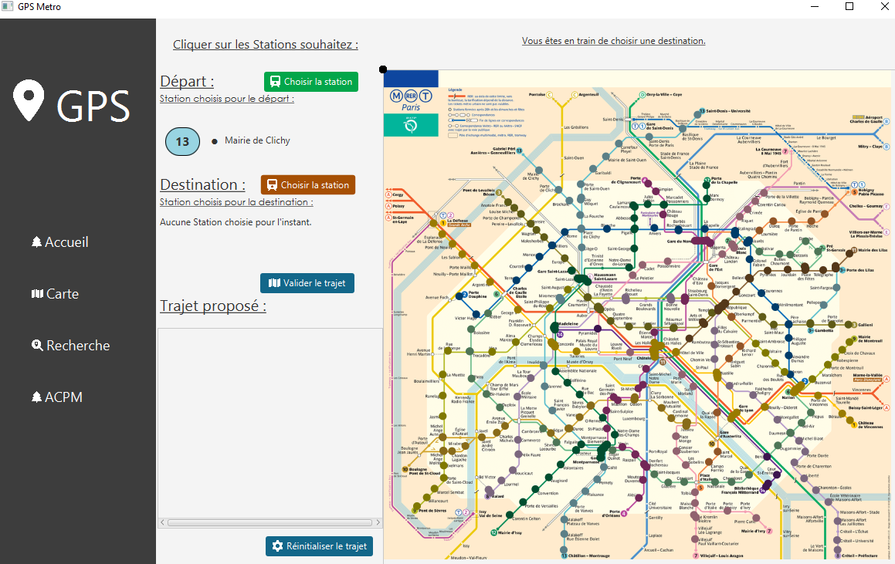
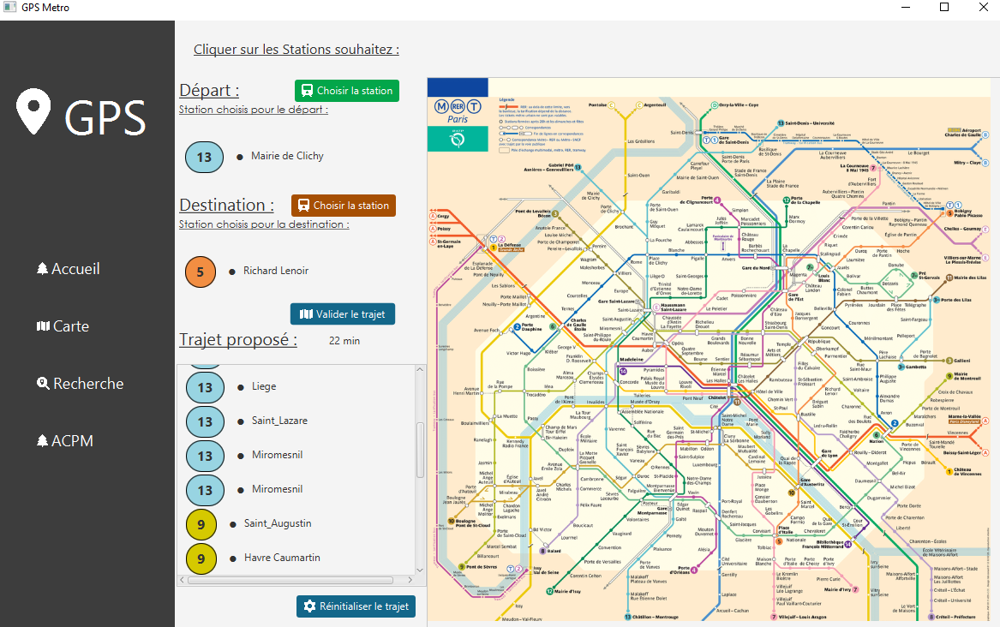
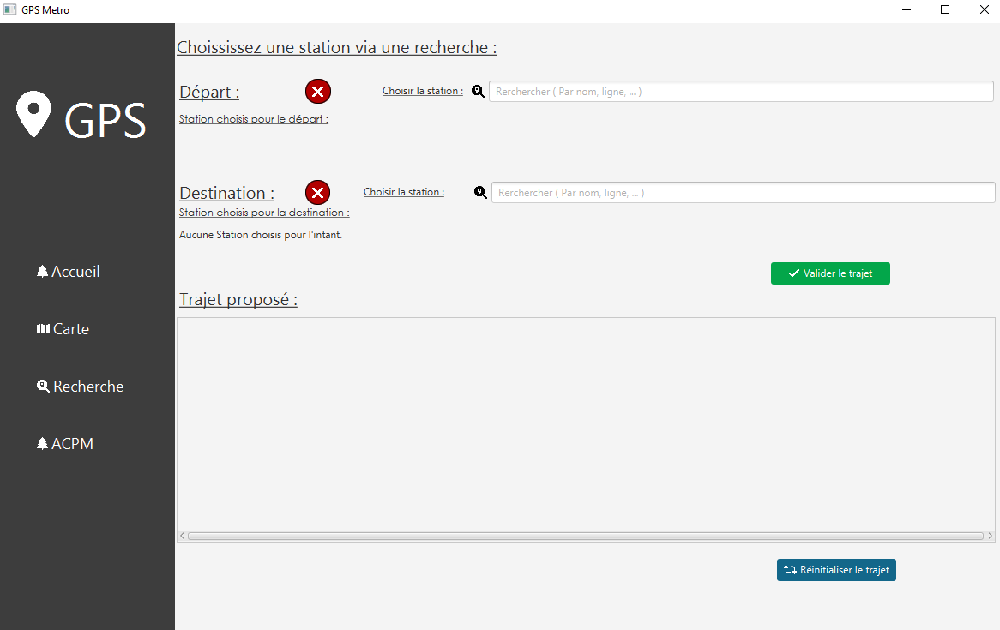

# Projet "Métro, Boulot, Dodo" - Rapport Théorie des Graphes 📚

## Introduction
Ce projet en Java explore la théorie des graphes à travers l'analyse du réseau du métro parisien, utilisant des algorithmes comme Bellman-Ford et Prim pour optimiser les trajets. 🚇

## Structures de Données
- Le graphe est modelé par ces deux structures, facilitant le traitement des problèmes de graphes. 🔍
- **Arêtes** : Représentées par une `ArrayList` de type `Edge`.
- **Sommets** : Un `HashSet` pour gérer les sommets visités.

## Implémentation des Algorithmes
- **Connexité** : Vérifiée via un parcours en profondeur dans `GraphConnectivity.java`.
- **Bellman-Ford** : Trouve le chemin le plus court, implémenté dans `BellmanFord.java`.
- **Prim** : Crée un arbre couvrant de poids minimal, codé dans `PrimAlgorithm.java`. 🌳

## Analyse de Complexité
- **Connexité** : O(E + V), adaptée au graphe du métro peu dense.
- **Bellman-Ford** : O(N*M), efficace même avec des poids négatifs.
- **Prim** : O(V * log(V)), optimale pour les graphes peu denses.

## Interface Graphique
Utilise JavaFX, structurée autour d'un `MainController` orchestrant les interactions entre les différentes pages (plan du métro, menu, recherche). 🖥️

## Exécution du Projet
- **Dépendances** : java openjdk-20, javaFX-sdk-21-0-1.
- **Interface Graphique** : Disponible pour Mac et Windows, exécutée via IntelliJ.
- **Terminal** : Option Docker disponible, bien que non recommandée sans interface graphique.

## Conclusion
Notre travail combine théorie des graphes et développement Java pour simplifier les trajets dans le métro parisien, démontrant la puissance des algorithmes de graphes dans des applications concrètes. 🚀

 
Première interface : Quand on cherche une station sur la map interractive des stations de Paris.
 

 
Illustration de l'itinéraire quand on valide les deux stations : 
 

 
Deuxième interface : Quand on utilise la fonctionnalité de recherche
 

 
Illustration de l'itinéraire de la deuxième interface
 

